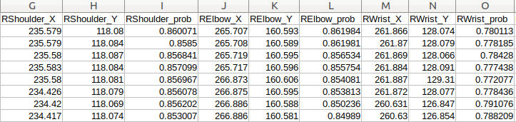

The purpose of the file `preprocess_coordinates_new.py` is to find out the peaks for segmenting the whole time series into individual signal.
It uses the config file `data_preprocessing_config` for passing arguments. Currently, the peaks information is stored 
already in the configs directory after manually going through each signal and correcting the location of maxima in 
case it is incorrect.

The code accepts a file that contains the data for each PID where the columns look like this:
```
RShoulder_X	RShoulder_Y	RShoulder_prob	RElbow_X RElbow_Y RElbow_prob RWrist_X	RWrist_Y RWrist_prob

```

where X and Y are the coordinates and the prob is the confidence of the OpenPose for each body part. OpenPose at the 
time of writing supported detecting 25 body parts.

Each row refers to the coordinates obtained from a single frame which constitutes a single time step in the final time
series. Note that this data is obtained after merging the coordinates information for all frames from the OpenPose
output. 

```
EXERCISE= type of exercise
STANDARDIZATION= boolean flag whether to standardize or not, not used anymore from this file
SCALING_TYPE= type of standardization
IGNORE_X_COORDINATE= boolean flag whether to ignore x coordinate, can be used to consider only x or y coordinate
MERGE_TYPE= type of merge between x and y coordinates
BASE_PATH=path info
FULL_COORDINATES_PATH=path info
SEGMENTED_COORDINATES_DIR=path info
SEGMENT_STATS_DIR=path info
MAX_PEAKS_TIME_SERIES= maximum number of time series we expect in one single video clip. It is predefined
INCREMENT= increment flag for finding peaks, not used anymore
SEGMENT_INFO_FILE= file containing the segmentation information for each PID
COMMON_PIDS= pids which are common to both shummer and video, used when comparing the performance
```

For each csv file, we obtain a final csv where we store the peak information for the time step corresponding to 
the maxima to segment the time series for the next part. The code also outputs additional information on the peaks. 
In addition, the code also provides the functionality to plot the peaks and save them.